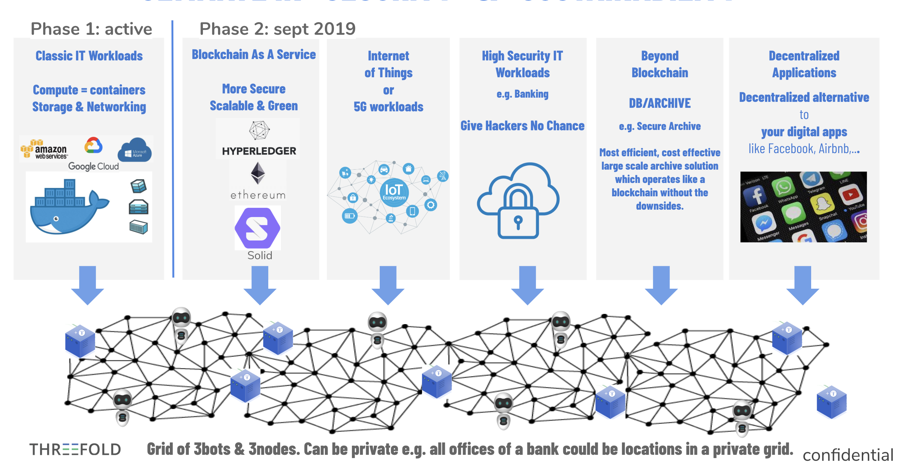
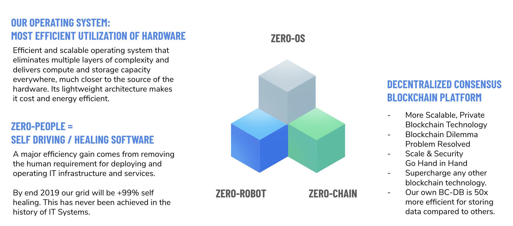

# Roadmap TF Tech

## Introduction

Our current 1.x series is in the field and empowers 18.000 CPU cores and more than 80.000.000 GB of storage. Today any container or S3 workload can run by means of the current solution.

Our aim is 100% autonomous IT and this can be used for quite some usecases.

## 3 components make it all happen

## the 3 layers or our 2.x generation

### Capacity Layer

The 3 components are being used in this layer, this is the layer of providing capacity (storage, networking, compute) to the applications. On this layer the applications are not self managed, they are provisioned by means of scripts or api usage.

Interface is the shell from jumpscale which we call kosmos. Kosmos has a rich api and scripting capability to allow the creation of complex workloads which can be deployed on top of the zero-OS nodes.

Any container workload can be brought life on our system. We are close to release our v2.0 at this point.
The 1.x release can be used by anyone today. The bulk of the work so far has been on this layer.

### Autonomous Layer

This is a new layer which has as aim to let an application run full autonomous.
The main ingredient here is the 3bot. The 3bot can be programmed to perform complex tasks in an easy way.

The 3bot knows how to deploy and maintain the status of large scale applications.

Interface here is the 3bot API and the 3bot SDK = Jumpscale X which allows IT people to add more knowledge to the 3bot.

### App Layer

We have developed a layer which allows any web application to interact with the 3bot.
This allows an app developer to get to results much more quickly. We don't publicly promote this layer yet.
We use it for our own usecases but the purpose is eventually to let others use this layer as well.

## 1.x.0 stack (active since start April 2019)

Grid only usable by application developers

### Services

- S3 storage service
- Virtual Zero-OS = container host (compatible with Docker)
- ZDB backend storage service
- Web gateway: how to make your service public

Above capabilities allow you to run most workloads which today would typically run on digitalocean or Amazon. Any app which runs on linux can run on the TF Grid.

### Benefits

- no more docker images, flists allow faster deployment, 10x less storage and bandwidth required 
- more security, because only signed files can run in the container
- more efficient storage leads in lower cost (10x less power used)
- can build any service on top

### Notes and Known Issues

- not user friendly, only meant for developers
- no user interface, only python scripting
- this is a pre-release version and the nodes are rebooted regularly and its data is erased (DO NOT RUN PRODUCTION !)
- uses TFT from testnet (so free money)

## TF Grid 1.0.1 (Aug 2019)

Still non production workloads and TFT's from testnet.

### Maintenance Release

- New JSX (jumpscale kosmos shell) release: easier to install/use
- Better documentation

### Example Workloads

easy to to deploy example workloads like

- Ethereum node example
- An Icecast node example
- A Minecraft server
- A Pastebin installation
- A PeerTube installation
- A multiplayer quake server (depends on licensing see http://ezquake.github.io/downloads.html)
- Odoo (ERP & Web Publishing system)
- Filemanager: see https://github.com/threefoldtech/tutorials/blob/master/tutorials/filestash/Filestash.py

## TFGrid 2.0.0 (Sept 2019)

Beta release which is using our self driving IT capabilities.

### NEW: Decentralized Apps (POC working on top of TFGrid 2.0)

SEE 3BOT app doc

Our community asked us to focus on enduser facing apps for the first production release.
The names are not final, it could be they will change for launch.

- FreeFlow Pages (alternative to Facebook): everyone can now create their own '''Facebook'''
- FreeFlow Browser (browser running in grid): privacy & freedom for all
- FreeFlow Connect (alternative to zoom/skype/hangout but decentralized): allow anyone to communicate, everywhere
- FreeFlow Files (filemanager, alternative to e.g. dropbox)
- FreeFlow Blog / News / Wiki

for business users (optional)

- FreeFlow Biz (ERP system with CRM, …) based on Odoo
- FreeFlow Publish (wiki & web publishing system)

Everyone will be able to provision their own private version of above described apps on top of the grid. 
All integrated with our 3bot mobile app.

### NEW: Blockchain As A Service

Help resolve the blockchain dilema problem.

- Run HyperLedger (ethereum compatible), Rivine (our own) on top of our TFGrid (more blockchains to follow)
- Human empowered blockchain: together with friends launch a blockchain, no-one can access or manipulate the blockchain, consensus required between the group to start or invalidate the blockchain.
- Benefits: easy = deploy a blockchain<5 min, cost effective, much more secure (no-one can interact with the code), real decentralized

### NEW: BCDB = BlockChain DataBase

A True scalable blockchain Database. 

- A true distributed, decentralized database (ledger)
- Store any information (e.g. contracts, …)
- Has all the features from a blockchain but not the downsides.
- Much more green & storage efficient (50x benefit compared to classic blockchain techno)
- Strongly Types schema support (complex types)
- Index & Search capabilities.
- Compatible with any chosen development language (Redis compatible API)
- Rich python client (userfriendly).

### NEW: 3bot = Your Digital Self

- host your own 3bot on the TF-Grid
- multi currency wallet (Gold, TFT, …)
- your own data/identity (API driven)
- integrates with 3bot mobile app

### NEW: “autonomous IT” preview (non production)

- run IT workloads with no people involved during operation has properties of a blockchain: consensus required for install, upgrade, remove.
- ultra secure, give hackers no chance because people are not involved in deploying or keeping the service up & running. There is nothing to hack.
- This is a preview release, only usable for real experts.

## TFGrid 2.1.0 (timing to be defined)

### upgrade to our compute & storage workloads

- even more decentralized S3 server, where each users 3bot manages the S3 server
- generic usable container service (docker conversion to container is supported ofcourse)
- web forwarding gateway (publish your services on the internet)

This service allows to run any application you want on the decentralized grid.
As long as an application runs on the linux operating system it can run on our grid.

### More decentralized apps

- FreeFlow Docs (office alternative running in cloud) based on OnlyOffice
- FreeFlow Git (Alternative to Github)

