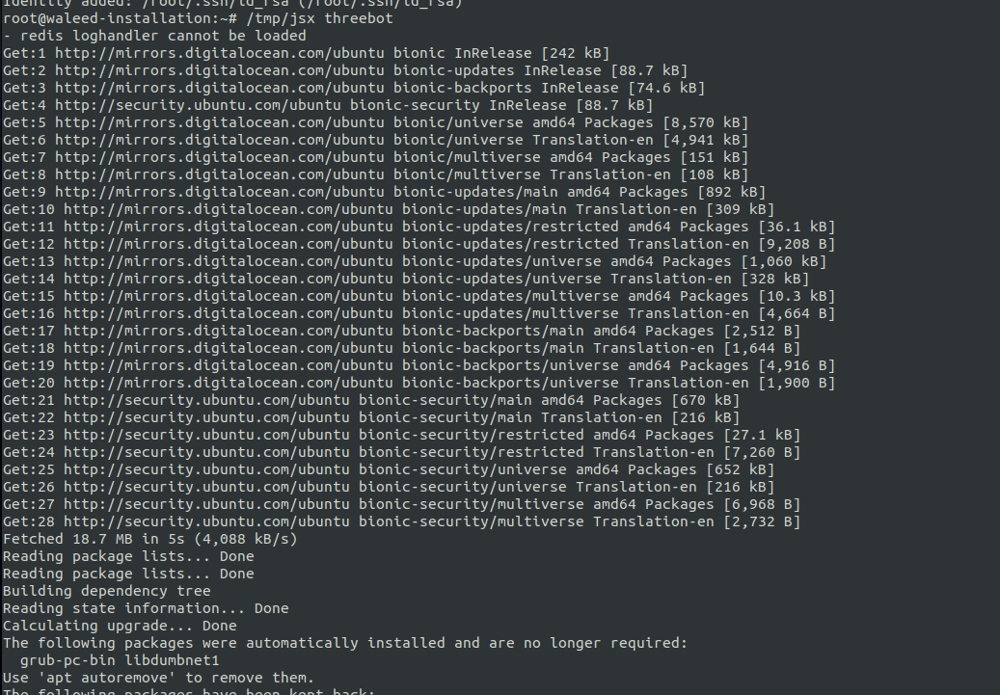
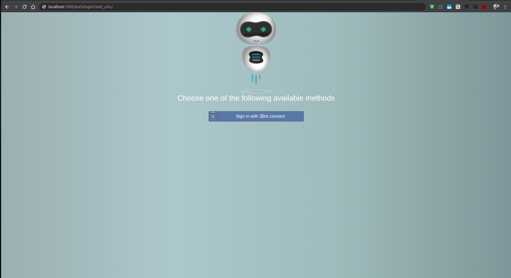
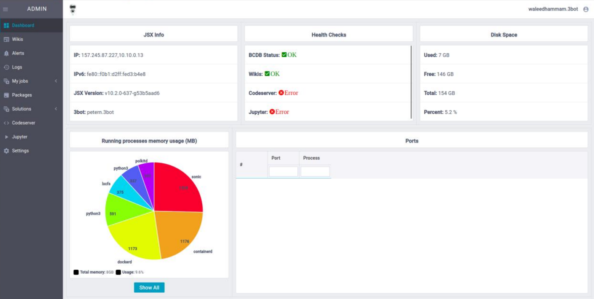

# JumpscaleX Installation Instructions

- [JumpscaleX Installation Instructions](#jumpscalex-installation-instructions)
  - [Prepare your machine](#prepare-your-machine)
    - [Supported Operating Systems](#supported-operating-systems)
    - [Required Packages](#required-packages)
  - [Installation](#installation)
    - [After Installation](#after-installation)


## Prepare your machine

JumpscaleX is currently supported for ubuntu and macOS, we will go through the installation process to be on a sanboxed container in your system.

### Supported Operating Systems

- Ubuntu 18.04 or newer
- macOS 10.7 or newer

Also we will need some requirments to be begin with. to install use the next command.

**Note** These packages are for ubuntu, for macOS users should have them already so skip this step

### Required Packages

- Open your terminal, or `press ctrl + alt + t` and type the following
  
    ```bash
    sudo -i; # this may ask you for your password
    apt update -y;
    apt install -y openssh-server locales curl git rsync unzip lsb python3 python3-pip;
    pip3 install click requests;
    ```

- Then this step is for both ubuntu and macOS

    ```bash
    pip3 install click requests
    ```

- Then we will make the following configuration which will give you an sshkey if you don't have one
  
    ```bash
    eval `ssh-agent -s`
    ssh-keygen
    ssh-add
    ```

- All configurations are ready. Next step is installation.

## Installation

- In your terminal execute the following, this will download the installer file, change its permission to make it executable

    ```bash
    curl https://raw.githubusercontent.com/threefoldtech/jumpscaleX_core/development/install/jsx.py?$RANDOM > /tmp/jsx;
    chmod +x /tmp/jsx;
    ```

- Then we can install our threebot using

    ```bash
    /tmp/jsx threebot;
    ```

The result will be something like the following, will take few minuts please wait untill it's done.



- After installation is done you will see the following screen


Congratulations, now you have your 3bot installed.

### After Installation

Your 3bot is protected by 3Bot connect, you need to register your current 3Bot, from 3Bot server shell (for now, you need to suffix your name with `.3bot`)

- We need to initalize out threebot open `kosmos`

```python
j.tools.threebot.init_my_threebot()
```
Here is an example of what you will enter


- Then to start your 3bot. just type in shell `3bot start`.

- After that we can go to our browser to this link: http://localhost:7000

- We will see the following screen

    

in this step we will need the threebot connect app, you can download it froms the [AppStore](https://apps.apple.com/us/app/3bot-connect/id1459845885) or [GooglePlayStore](https://play.google.com/store/apps/details?id=org.jimber.threebotlogin&hl=en) and use it to login with the 3Bot name you registered.

- Also, other people can access the dashboard, but they need to be added to admins from `Settings`, Also, admins can be dded to `j.tools.threebot.me.default.admins` via `kosmos` shell example:

```python3
j.tools.threebot.me.default.admins.append("hamada.3bot")
j.tools.threebot.me.default.save()
```

- After logging in we can now see the dashboard, you can see your 3bot informations, logs, alerts, edit your wikis and much more

    
