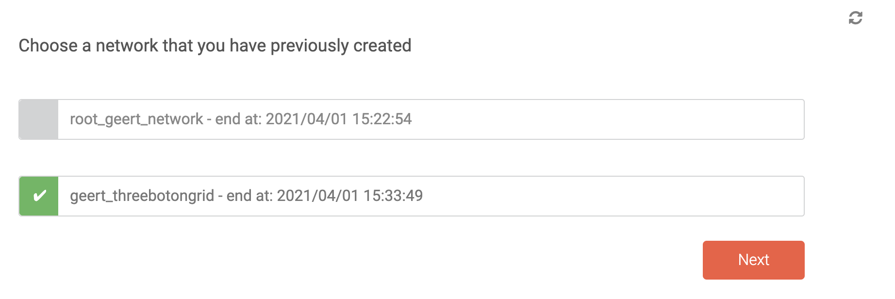

# Setting up a Network
## How to set up a network using the chatflows?

The network set-up is integrated in each of the chatflows (on ubuntu, flist, S3, kubernetes, ...). 

- If you haven't set up your network yet, select a new network : 

This network then needs to be defined using Wireguard. 
A different setup is needed on Ubuntu machines and on Macbook : 
- For Ubuntu machines, install wireguard using wg-quick

- On MacBook, please install the Wireguard application and define a new tunnel 

- If you previously defined a network, you can reuse an existing network.

## How to set up a network using the Jupyter Notebooks?
In the Navbar you will find the section "NEED THE NAME" that has pre-made notebooks. These will guide you through all the steps you need to take to setup a network, but do not limit you when it comes to parameter as you can edit the scripts as you go.

## How to set up a network using the CodeServer?
Within the SDK you'll find the CodeServer in the left hand navbar.
In here you will find all files and code you need to set up a network and have total control over it, set your parameters, choose your nodes, etc.
