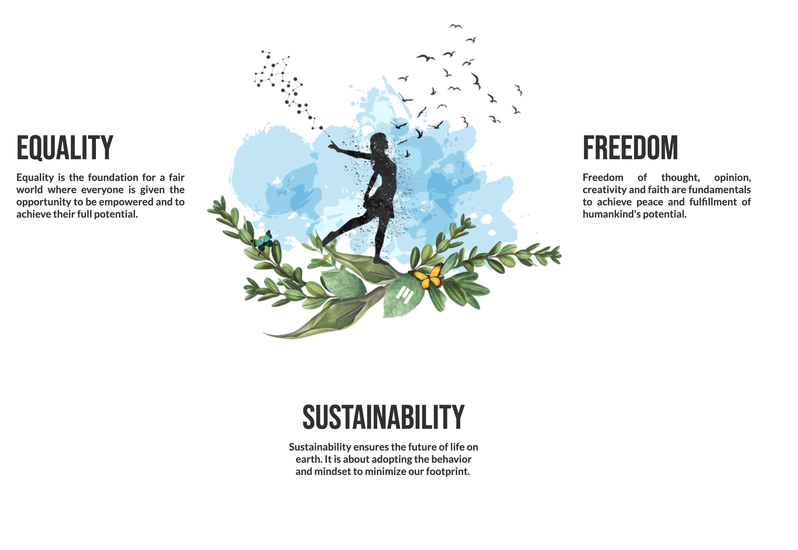

# THREEFOLD WIKI

This Wiki is a gathering of most of our created content in regards to the ThreeFold Foundation.
It features the way we work together, our definitions, our tools, presentations and much more for you to read and learn about.

## INTERNET ACCESS | A HUMAN RIGHT

In 2016, the United Nations officially declared Internet access to be a human right. The right to internet access aims to protect people’s freedom of expression and opinion, as well as other fundamentals such as access to knowledge and information. 

Yet as of today, about 48% of humanity remains unconnected to the Internet, creating huge inequalities in the access to information and knowledge. It is important that the right steps are taken to improve the relationship between governments and citizens and to uphold all human rights.
 
To make the new internet accessible and equal to all, ThreeFold built an infrastructure that is affordable to all and collectively owned by the network peers. To ensure a fair and equal distribution of the internet to everyone, fully sponsored capacity will be deployed in remote regions of our world. 

## AUTONOMY | FOR EVERYONE

The Internet evolved to become the world's largest database of information and knowledge, opening up exponential growth on personal, organizational and economic levels. Yet it is owned by large international companies that exploits users data. 

The current approach of many governments and countries is to cut the Internet into pieces by limiting its accessibility and enforcing regulations. We need an internet that protects our digital freedom and fair access to global information for everyone, everywhere.
 
ThreeFold's internet is a peer-to-peer internet - owned by the users. All the technology of this new internet is open-source and the whole experience is built around the fundamentals of a peer-to-peer network. On this new internet, everyone owns their data and experiences - digital freedom.

## A GREEN INTERNET | FOR OUR PLANET

The current internet consumes about 10% of global energy production. With the imminent boom of emerging technologies such as Blockchain, Internet of Things, Virtual Reality, Artificial Intelligence and 5G, the Internet’s energy consumption is expected to increase exponentially. 

The current industry solutions focuses on increasing the use of renewable energies to power data centers. However this is not a viable solution as data centers consume enormous amounts of energy. Therefore, a new solution that can drastically reduce the global internet’s energy consumption is needed. 
  
ThreeFold brings the world the first true peer-to-peer Internet. It uses pioneering technologies that remove the need for centralized and power-hungry data centers, consumes 90% less energy, and uses 90% less international fiber network capacity. 

## NEW TO THREEFOLD?

Check out this video on how it all started and what we have accomplished already. 

<iframe width="560" height="315" src="https://www.youtube.com/embed/AAV4yYZ_P3k" frameborder="0" allow="accelerometer; autoplay; encrypted-media; gyroscope; picture-in-picture" allowfullscreen></iframe>

If you have any questions please join the discussions about ThreeFold on our [Forum](https://forum.threefold.io/).
ThreeFold also has created a decentralized social media platform called [FreeFlowPages](https://www.freeflowpages.com) you are invited to create your profile there and follow our and other groups.

## MORE ONLINE RESOURCES

For additional information, please refer to our official channels:

[Website](https://www.threefold.io)

[YouTube channel](https://youtube.com/c/ThreeFoldFoundation)

[Facebook](https://facebook.com/ThreeFold.io)

[LinkedIn](https://linkedin.com/company/threefold-foundation/)

[Twitter](https://twitter.com/threefold_io) 

[Announcement Telegram Group](https://t.me/threefoldnews)