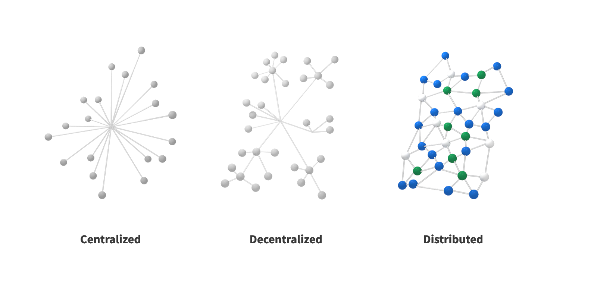
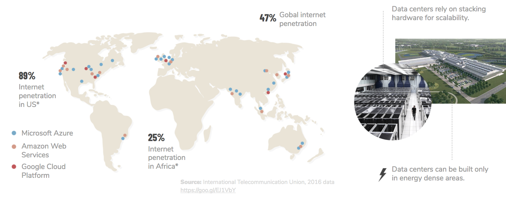
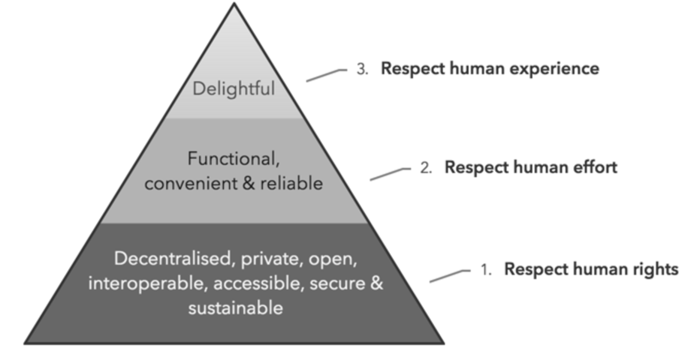
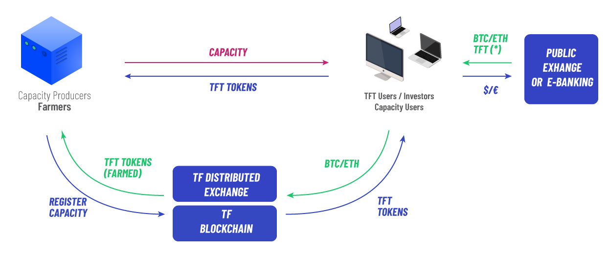
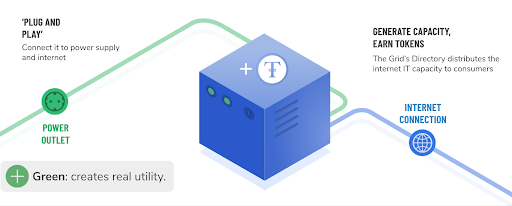
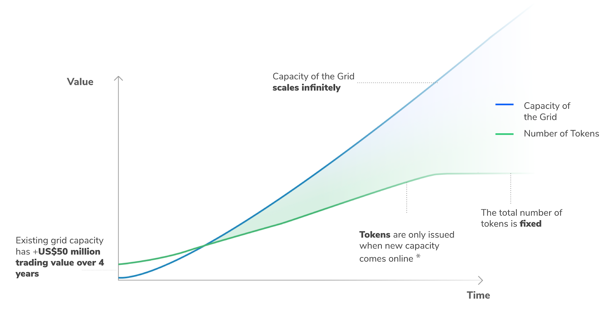
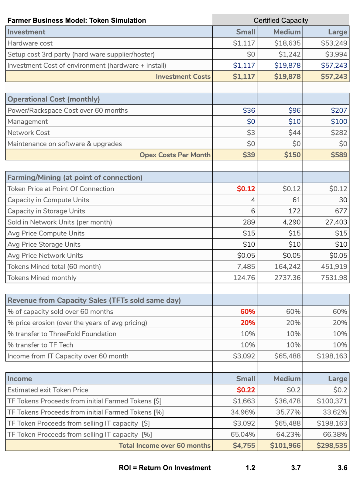

**The ThreeFold Grid and Token**

**WHITEPAPER**

**v 1.0.4 (Sept 2019)**

[TOC]

# Abstract {#abstract}

The Internet is growing at an accelerated rate. To service this demand a few large companies (Google, Amazon, Alibaba, Facebook, etc.) have built and continue to build supersized, power-hungry and centralized data centers. These data centers make up the majority of all Internet capacity available today. However, the Internet is expanding much faster than datacenters and the planet can cope with. The solution is to have the Internet be more **distributed**, **cost**-**effective**, **neutral,** and **sustainable**. ThreeFold has developed such a new technology, the ThreeFold Grid (Grid) and a token which enables all this to happen.

*   To build this grid, the ThreeFold community has developed the ThreeFold Token (TFT), a decentralized digital currency used to buy autonomous and decentralized Internet services (compute, storage, and application) on the ThreeFold Network. A TFT represents a unit of reservation of autonomous Internet capacity on the ThreeFold Network. The TFT is supported by the fastest growing commodity in the world, the Internet.
*   Independent ThreeFold Farmers (Farmers), generate Internet capacity. They do this by connecting IT hardware (servers) to the Internet. As a result TF Tokens (TFT) are generated on the ThreeFold Blockchain which are now usable as a true digital currency.
*   ThreeFold Tech is a technology company which is developing & commercializing “Self Driving IT” to power future innovation through decentralization. ThreeFold Tech has resolved a number of fundamental challenges in the world of IT by simplifying the required architecture to three fundamental layers:  a capacity layer, an autonomous layer and the distributed applications layer  

*   For the capacity layer grid capacity is produced, purchased, and allocated locally, much like electricity. Service providers are then able to host their services and applications close to the end user, leading to significantly greater performance, lower price points, and better margins. This will eventually lead to liquidity for the ThreeFold Tokens. ThreeFold’s Operating System allows Farmers to deliver Internet/IT capacity to the TF Grid with up to[ 10 times the energy savings](https://wiki.foundation.grid.tf/#/blog/10x-times-power) than traditional data centers. 

*   Already today, the ThreeFold Grid has more capacity online compared to the sum of all capacity of all blockchain capacity players together. 
*   The ThreeFold Grid is positioned as  a complementary layer to enable blockchain and cloud projects to scale beyond current limitations  to the edge of the network.  
*   The autonomous layer is where a large number  of virtual workers will perform required grid operational tasks to create autonomy for capacity operations and provide a foundation to build and run decentralised  applications.  
*   The D’apps layer is where decentralised and distributed apps will be built and run.  There is an SDK available to build these applications.

# Mission Statement {#mission-statement}

The Internet is one of the biggest innovations of the last century, if not the biggest. 

Today, the way the Internet is created, it is not distributed, it is not neutral, it is not environmentally friendly and it is not cost-effective. Our aim is to change this. We have the technology and the will to do this today.

The Internet should be a human right. It's a source of education, it allows people to communicate, and connects people and events globally.

Our mission is to expand the current Internet to all areas of the world, and to allow everyone to use this Internet at a fraction of its current price. We want to make it easy for people to own their data and make it harder for companies to (ab)use this data. We want to help save the planet by making sure that this new Internet capacity is much more energy friendly.

Our second mission is to create a new type of digital currency. A currency which is truly decentralized,  inclusive and supported by an energy efficient and highly demanded internet capacity. A currency which can be used to buy and sell internet capacity as well as goods or services anywhere in the world. 

This decentralized digital currency (ThreeFold Token) is the result of independent people or companies expanding the new Internet in a process which we call farming.

The combination of a better (neutral) Internet and a better digital currency (Token) can be a huge benefit for many millions of people in the world, stimulate innovation and have a positive impact on the world. 

**Our Mission**

*   **A truly Neutral, Decentralized and Green Upgraded Internet  = ThreeFold Grid or TF Grid**
*   **A truly Decentralized, Green and Inclusive  Digital Currency = ThreeFold Token or TFT**

# Background {#background}

Without adequate Internet capacity, companies and societies are unable to develop and evolve – yet this is the future we face today. 

The spectacular advancement of Internet capacity over the past decade has been due in large part to the hyper-scale efficiencies of multi-billion-dollar data centers. But this model is fast becoming obsolete. Short-term demand for Internet capacity is far outpacing available supply, thanks to power-intensive applications like Big Data, the Internet of Things (IoT), and Artificial Intelligence (AI). 

Today’s architecture will never be able to support future demand, for many reasons:

*   In the centralized model, data must travel back and forth between users and data centers. These journeys, often thousands of miles, already slow computing speeds and undermine performance. This problem will only get worse.
*   In many cases, these long journeys expose data to third-party intervention, raising government security concerns. Governments today prefer Internet infrastructure to be “in country.” ThreeFold prevents data from crossing borders without authorization. 

*   Explosive growth in processing and storage driven by the Internet of Things (IoT) pushes computing and storage closer to the Edge, as close to the sensors as possible; today’s data centers are too remote.
*   With demand for capacity set to grow exponentially in the next decade, the existing Internet “piping” will not be able to keep up.  
*   The hyper-scale model places control of the world’s data and Internet capacity in the hands of a few tech giants, raising neutrality and privacy concerns, going against the principles on which the Internet was founded.
*   Persistent issues with security, outages, and lost data regularly underscore the weakness of the centralized model. 
*   Power-hungry data centers consume energy at unsustainable rates. Already, the collective energy consumption of the world’s data centers exceeds annual power consumption in the UK by more than 30 percent. This energy usage results in about 2 percent of global greenhouse gas emissions – a carbon footprint comparable to that of the entire airline industry. 
*   To meet 2022 demand, the world will need more than 4,000 new data centers[^1], costing an estimated $5 trillion[^2] to build and consuming an additional 400GW/h. This is roughly equivalent to Japan’s energy consumption and would place an impossible strain on global electricity grids. Already, demand for data center storage is causing memory shortages and price hikes. 

*   New digital currencies are required to allow people to do business on this new Internet. Most of current digital currencies (crypto currencies) are too speculative, power hungry and not scalable. 

In 2016, the United Nations declared Internet access a basic human right. But we are a long way from that reality. Africa, for example, has Internet penetration of just 25 percent. As underserved regions develop, affordable, neutral access will increasingly be the expectation, rather than the exception. To get there, we need to vastly expand capacity to these regions.

ThreeFold offers a sustainable, cost-effective solution, ideal for both developed and emerging economies. Just as the global financial model of a handful of powerful central banks and too-big-to-fail financial giants will likely be remade by the distributed networks of cryptocurrencies, a green, equitable, and scalable Internet is needed to accommodate the glbao capacity demand of 21st century. 

**Enter the ThreeFold Movement.**

We are different and proud to be different., We are a real and complementary movement which will bring needed change to the word and we are a tech company (TFTech) with real disruptive technology which is looking for the **RIGHT** financial and strategic partners.

We are a great group of people who mean well and are super passionate.

# Values {#values}

**Respect The World**

No matter economic status or geographic location, everyone is entitled to the Internet capacity that provides access to resources and education, enabling people to become an integral part of the digital economy.

This new distributed economy will allow people to work together across borders, free from the control of large corporations just focused on the bottom line. We want this world to be driven by love and respect, instead of ego and greed. As such, the ThreeFold Foundation is 100 percent transparent.

**Respect Human Effort**

Today’s IT industry is based on complexity, with business models built around increasingly complex technologies. The result is a buggy and environmentally-unfriendly system that favors the elite. 

We have created a user-friendly “IT as energy” solution, in which the Internet is affordable and available everywhere, just like electricity.

**Respect Ethical Design**

We expect the Foundation and its product to reflect these values. Thus, we have underwritten a concept called Ethical Design. To read more about this and other relevant topics, please visit our wiki-based extranet:[http://tiny.cc/values_extranet](http://tiny.cc/values_extranet).

# ThreeFold Token & ThreeFold Grid Principles {#threefold-token-&-threefold-grid-principles}

To build this Grid, ThreeFold contributors have developed the ThreeFold Token (TFT), a decentralized digital currency with a commercial utility use. TFTs are generated only when Internet capacity is added to the Grid, which means that TFTs are directly generated  by Internet capacity being added to  the ThreeFold network. The Grid is managed by the ThreeFold blockchain (TF Chain), which can issue a maximum of 100 billion TFTs. 

The only way how new Tokens can be created is as a result of independent “farmers” connecting servers (storage and compute) to the existing Internet. No Tokens have been issued, printed or created any other way. There are no founder tokens, or bonus tokens… 

ThreeFold Farmers are independent third parties who invest in hardware (storage and computing servers) and connect it to the Grid to create new capacity. Every Farmer’s capacity, called a Farming Pool, is registered on the Zero Chain by running Zero OS, the ThreeFold Operating System, which makes it available to users worldwide. TFTs are the only accepted payment method for capacity on the ThreeFold Grid, and thus represent a utility. TFTs can also be used to buy other goods and services on the Internet.

The TF Blockchain & Minting Software issues new TFTs to each Farm Pool every month using the following calculation:

**Monthly issued tokens per farming pool = Average monthly sales price of connected capacity (*) / difficulty level**

(*) expressed in tokens at the time of connection.

Tokens are released to the farmer monthly over a 60 month period, unless farmer disconnects hardware earlier, at which point any remaining unvested tokens are burned. 

**TFTs are generated  by a factor of 8 difficulty level  during creation, i.e. If 100% of capacity is sold at connection time, then 8 times more TFTs would be required than have been issued. This mechanism allows the internet capacity to always be greater   than the sum of all tokens at any given time.  **

The TF Foundation expects most Farming Pools to achieve an uptime of 99.5 percent, with commercial providers being as high as 99.9 percent. The TF Chain only issues Tokens to Farmers whose capacity meets its uptime target. The TF Chain software will execute these checks on a random basis. These are peer checks done by independent Farming Pools. 

Thanks to ThreeFold Tech’s innovative software, the Farming Pools use considerably less power than traditional data centers. Internet capacity is produced and allocated locally, similar to the way electricity and other utilities are purchased and used today. This allows any digital service or application provider anywhere in the world to host their applications nearer to the end user, boosting performance and efficiency. 

**ThreeFold Tokens**

To uphold its principles of decentralization, the Foundation contributors have created a number of ways in and out of the ThreeFold Token economy.  Which include but not limited to; crypto exchanges,  ([atomic](https://hackernoon.com/atomic-swaps-simply-explained-how-to-swap-cryptocurrencies-without-a-middleman-6cd29680c32e)) swaps, OTC (over the counter) desks, and TF Farmers. The ThreeFold Token and the ThreeFold blockchain are live as of the end of March 2018.

TFTs are exclusively created by the TF blockchain and minting software when new capacity is added to the Grid. The tokens are subsequently released to the Farmers monthly over a 60 months period. Farming Pools must remain connected to the TF Grid to have their tokens to continue to vest. This issuance of Tokens is called “farming.” ThreeFold chose to call its token mining “farming”, because generating ThreeFold tokens is very green. ThreeFold farming is energy efficient due to its operating system and the proof-of-blockstake blockchain, both of which require little energy to operate. 

The current plans include to create liquidity of the ThreeFold token  are:

*   the ThreeFold Exchange, a fully distributed and decentralized token exchange. This means that all transactions can be done peer-to-peer with no mediation from a centralized entity, which would typically have to ensure that transactions are done fairly and securely and charged exchange fees for its services. On the TF Exchange security and fairness of transactions is ensured by Atomic Swaps, or atomic cross-chain trading, an innovative exchange technology that accomplishes trading peer-to-peer in a trustless environment, i.e. without the need to trust an intermediary or pay exchange fees. 
*   Initial Exchange Offering  (IEO).  Farmers have been creating ThreeFold Tokens since March 2018 and have collected tokens when they had successfully kept their promises to keep capacity available (for testing purposes, LIVENET is foreseen for Q1 2020) for the month.  The IEO will promote and market the ThreeFold Token on a number of exchanges and invite the community to buy, or sell Tokens.  In spirit of the decentralised character of the technology and foundation this IEO will be hosted in January 2020  by one of the largest farmers on behalf of the ThreeFold community.
*   TF Tech is involved in other tokenization projects (Gold, Euro) and will create technology to  swap  ([atomic](https://hackernoon.com/atomic-swaps-simply-explained-how-to-swap-cryptocurrencies-without-a-middleman-6cd29680c32e)) between these currencies without involvement of a middle man

More details can be found on the [ThreeFold Website](http://www.threefold.io).

**ThreeFold Token’s objectives are threefold:**

**Neutral**: The ThreeFold Foundation is building a neutral and digitally responsible world by connecting humanity to a decentralized, distributed, neutral, and green Internet owned by all of us. The ThreeFold Foundation does not have any shareholders and is not owned or controlled by any other corporation. The ThreeFold Foundation is only a promotion organization. All technology used by ThreeFold is open source. All users and ThreeFold Nodes are registered on a blockchain-based identity management platform enhancing security and privacy.  ​

<!--- TODO: 1 utility driven, 2 mentions OCA and partnership is not formalized --->
**Utility-Driven**: The TFT is designed to have specific commercial utility as the currency for buying and selling IT Capacity on the TF Grid. Our aim is to make the TFT a real digital currency which can be used on on global scale for use cases even beyond selling and buying capacity. We believe people will appreciate the TFT because of its stability and security.. There are already big use cases being rolled out e.g. in Belgium we are enabling a first network of 8000 merchants, see [OurCityApps.com](https://ourcityapps.com/). 

**Green**: The ThreeFold Chain’s Operating System (Zero OS) runs on a decentralized and distributed network of dedicated hyper-efficient Zero Node (Node) infrastructure, which enables extreme scalability to be delivered with an extremely low carbon footprint.

The TF Chain has been built using our [Rivine.io](https://github.com/rivine/rivine) blockchain stack. It is a distributed, “proof-of-blockstake” blockchain.  As a multi-chain platform, the TF Chain is not constrained in terms of scalability or slow transaction processing times as others are, and it does not consume huge  amounts of energy for mining purposes.

ThreeFold Tokens can be bought from ThreeFold Farmers or by means of Ripple, Ethereum or Bitcoin using the TF and/or Public Exchange. 

# ThreeFold Farmers {#threefold-farmers}

ThreeFold Farmers (“TF Farmer” or “Farmer”) are independent, individuals or entities who invest in IT equipment consisting of storage and compute servers (“Farming Pools”), thus becoming ThreeFold Nodes (“TF Nodes” or “Nodes”), that are connected to the TF Grid and are registered on the TF Chain. 

Each TF Node runs the ThreeFold software, which is the TF operating system = Zero OS, and TF Chain software. 

The Zero OS software allows anyone in the world to use the IT capacity generated on Nodes to host their Internet workloads – storage apps, archive capacity, web applications, artificial intelligence, IoT, docker containers, and more. 

To do so, people need TF Tokens – which are used as the only means of purchasing capacity on the TF Grid. As such, the TF Tokens are supported by a true marketplace, the supply and demand of Internet capacity. 

By doing so, Internet capacity is produced on the TF Grid and is sold via the TF Directory. The TF Directory is a “marketplace” for selling TF node generated IT capacity.

Note that, to use this IT Capacity through the TF Grid, people need to own TF Tokens as they are the only mechanism to purchase this capacity on the TF Grid. As such, TF Tokens represent a true utility. 

Tokens are only issued when capacity gets connected to the Internet. The TF Chain software validates the capacity of the connected ThreeFold Node and issues new Tokens using the following formula each month:

**_T = number of Tokens_**

**_CU =[Compute Units](https://docs.grid.tf/threefold/info/src/branch/master/concepts/cloud_units.md) deployed_**

**_SU =[Storage Units](https://docs.grid.tf/threefold/info/src/branch/master/concepts/cloud_units.md) deployed_**

**_ACPT = Average Compute Unit price in Tokens at the time of connection_**

 ** _(Avg Compute Unit price divided by Token price at connection)_**

**_ASPT = Average Storage Unit price in Tokens at the time of connection_**

 ** _(Avg Storage Unit price divided by Token price at connection)_**

**_D = Difficulty level (Unmanaged Capacity) = 8 for YR 2020_**

When selling capacity, Farmers will earn the following amount of Tokens in a given month: 

**_CU =[Compute Units](https://docs.grid.tf/threefold/info/src/branch/master/concepts/cloud_units.md)deployed_**

**_SU =[Storage Units](https://docs.grid.tf/threefold/info/src/branch/master/concepts/cloud_units.md)deployed_**

**_CP = Farmer’s Compute Unit price - expressed in Tokens_**

**_SP = Farmer’s Storage Unit price - expressed in Tokens_**

**_U = Utilisation_**

**_T = Token price at time of capacity reservation_**
s   

This mechanism guarantees that Tokens are always generated by active Internet capacity. 

Example: 

*   **Given Parameters:**
*   Farmer deploys 1,000 Compute Units (CU) & 2,500 Storage Units (SU)
*   Average price defined on the TF Directory is US $10 for CU & SU
*   Token price at initial connectivity = US $0.20
*   Difficulty Level = 8
*   Utilization = 60%
*   Estimated Token exit price = US $0.80
*   **Tokens per month - When capacity is initially connected:**
*   The number of Tokens minted for connecting and producing capacity to the grid per month: 

*   In the above example, the Farmer will receive 21,875 Tokens each month for 60 months.	
*   **Tokens per month - When capacity is sold:**
*   The number of Tokens earn by selling capacity per month: 

*   In the above example, the Farmer will receive 26,250 Tokens per month but only when the capacity was up more than the specified Service Level Agreement e.g. 99.5% uptime during the last 30 days.
*   10% of the Tokens will go to ThreeFold Foundation for the further promotion of the TF Grid.
*   10% of the Tokens will go to ThreeFold Tech for support in case of  Certified Capacity. 

# How Can You Help? {#how-can-you-help}

The ThreeFold community is promoting this new Internet, and we need a lot of people who would like to help to make this dream a reality. Our ambitious aim is to have more than USD $1 Billion invested in Farming capacity activities within a few years by independent farmers from all over the world.

## ThreeFold Token (TFT)

If your are interested in hosting capacity, or developing decentralized applications and or want to support the growth of ThreeFold Project, then TFT’s are for you.

Please visit the ThreeFold website for more info [www.threefold.io](www.threefold.io). 

You can buy these tokens through digital exchanges or directly from the Farmers on the the ThreeFold Network. 

ThreeFold Token (TFT) is a decentralized digital currency used to buy autonomous and decentralized Internet services (compute, storage, and application) on the ThreeFold Network.

**ThreeFold Tech Investors**

The technology behind the grid is being developed by ThreeFold Tech, which is a Belgium software tech company. ThreeFold Tech is a spinoff from Incubaid. The incubator from Kristof who accomplished already 6 exits with very good return for the investors.

## Ambassadors {#ambassadors}

We need people to help us promote the ThreeFold message, through their network, who share our values and who want to make the world a better place. 

We ask that each Ambassadors provide at least a few hours of their time per month to help us with this project. Each Ambassador will be rewarded with Tokens as a form of appreciation. We have currently an active ambassador community of over 100 who meet on a biweekly basis online.  

They actively engage in bringing forward their networks and they are regularly asked for their opinion if TF Foundation of technology need to make an impactful decisionThey also share a Telegram channel, please let us now if you are interested to join them.

## Chapters {#chapters}

Ambassadors organize in Chapters to organize for contributing to the ThreeFold movement. Some are Farming cooperatives, others do promotion activities, others write documentation, …

There are many things to be done. Please contact us to know if there is a Chapter in your neighbourhood.

## Guardians {#guardians}

Guardians make up the ThreeFold Foundation Board and make decisions relating to the Foundation and Ecosystem such as any changes to difficulty level.

## Farmers {#farmers}

We are looking for people who want to Farm IT Capacity for this new Internet.

Today we have around 60+ famers and around 600+ nodes in the global grid.  These farmers range in size from people that have in a small, single CPU, single disk box that they host in their study to farmers that have built business models around finding investors and deploying datacenter racks full of equipment in.  Here’s an overview of the current locations:

Farmers can choose to do all the work themselves (“Do It Yourself”) or they can use a Farming Cooperative. With the Cooperative option, you would purchase IT Capacity producing hardware that is operated and monitored by a Farming Cooperative. The advantage of Farming through a Cooperative is that it gives you peace of mind that your hardware is being attended to at all times; in the most effective and efficient manner. With a Cooperative there is an initial one-time hardware acquisition and setup cost as well as a monthly hosting and management fee. It's up to each Cooperative to define their own pricing structures.

There are multiple Farming Cooperatives and others are in the process of being created.

# Farmers Business Model {#farmers-business-model}

**Farmers**: Purchase or manufacture ThreeFold Nodes and connect them to the TF Grid to produce IT Capacity. Once this capacity has been validated by the TF Chain, the Farmer is awarded Tokens every 30 days. The Farmer also gets Tokens for selling this capacity via the TF Directory. 

Estimated costs and revenue associated with operating an environment is laid out below:

Please note, the above model uses estimates for the cost of the hardware and installation as well as for the utilization and potential price of the Token. Your individual results may materially differ from the above. 

# Technology {#technology}

ThreeFold Tech has developed, promotes & uses open-source technology. This technology has been actively developing components of the core technology of the ThreeFold Grid for the past 10 years which are all open-source. 

This technology consists of three major building blocks: 

**Zero OS** is a stateless operating system which enables distributed hardware to form the TF Grid which generates both IT storage and compute capacity.

**Zero Robot** is a self-healing Intelligence system which controls and operates the TF Grid without the help of people and reserves, procures and executes workloads on the grid using our Jumpscale and At Your Service automation platform. 

**Zero Chain** is the blockchain framework: store of digital currencies, management of 3bots (our digital users), verification of communication (key management), ledger for digital notary services, ....

See  [http://flow.threefold.io](http://flow.threefold.io)  for lots of more info an also more technical information.

## Zero OS = Stateless Operating System

The global TF Grid is composed of thousands (eventually millions) of nodes (called Zero Nodes) distributed geographically around the world and running our operating system called Zero OS.

The Zero OS is supported by INTEL based Hardware Platforms today.

To manage this complexity a stateless operating system is a must; such a system avoids upgrades, has no local filesystem or many of the other complex layers you would find in standard operating systems like linux. Zero OS has no human user interface components like UI or Shell Console, only API’s which are used by the Zero Robots.

**Benefits:**

*   **Performance:** 
Lightweight Operating System (“OS”) without overhead for running bare-metal machines.  This means there are no complex install procedures required, just a thin efficient software layer on top of hardware.
*   **Private:**

    “No data left behind” when workloads move from one node to another.

*   **Distributed:** 
Capacity is generated without the need for data centers at The Edge (which means as close as possible to where end users uses the Internet capacity)
*   **Highly-available:** 
Any of the Zero Nodes running the Zero OS can go down without impact of the applications running on top of the TF Grid.
*   **Portability:** 
Moving applications and data from one node to another within the Grid is easy.
*   **Secure: ** 
Much less layers & open-source software deliver better security.
*   **Green: ** 
Advanced algorithms within Zero OS optimize hardware performance and efficiency   which results in minimal node power consumption (upto 10x benefit).
*   **Integrated storage system:** 
Block & Object based storage systems which self-heal, autoscale - fast enough for any scale out workload.

This technology is available today and can be found on our[ open-source repositories on github.](https://github.com/zero-os)

## Zero Robot = Self-Healing Technology

Zero Robots are intelligent virtual (no humans involved) system administrators which guarantee the uptime, security and performance of the TF-Grid.

The purpose of the Zero Robots:

*   **Self-Healing:** Zero Robots are smart enough to deal with all kinds of expected issues like broken hardware, sites being disconnected from the internet, resource overload situations (e.g. overload of CPU or hard disks almost full), and will rebalance the workloads without causing downtime.
*   **Lifecycle Management**: Each application running on the grid can be managed through it's full lifecycle by the Zero Robots.
*   **Autoscaling:** The platform automatically scales to meet application and infrastructure performance requirements.

Today our Zero Robot technology can cover the large majority of issues, although some manual interventions are currently still required, by the end of 2019 the aim is to be 100% self-healing and thus zero people will be required to manage the TF Grid.

This technology is available today and can be found on our [open-source repositories on github.](https://github.com/threefoldtech) Jumpscale is a framework we have been working on for more than 10 years.

## Zero Chain = Our Blockchain Framework

The Zero Chain is a set of blockchain technologies which are currently used inside the TF Grid and invisible for the user today. 

Purpose of The Zero Chain:

*   Secures the communication between users of the TF Grid and the Zero Robots.
*   Not based on proof of work  - makes it green.
*   Scalable new algorithms for distributed databases as well as smart contracts.
*   Can work on ‘record level’ which leads to faster transaction times and more a clearer structure which in turn leads to more simplicity & security.
*   Secure Execution Environments will allow developers to develop blockchain workloads which can be written in multiple programming languages.

All these technologies are open-source and can be found on [github](https://github.com/itsyouonline). 

# Who we are {#who-we-are}

See [our team](https://threefold.io/public/#/team) on our website.

# Thank You {#thank-you}

Thank you for reading our white paper. 

We hope that we were able to give you a sense of how we intend to realize our mission of a better, safer and greener world for all. Please join us in this opportunity to change the world. Together, we can make a huge difference for ourselves and billions of others and help save the planet in doing so. It is all about optimally enabling easy access to technology for all citizens of the world. We believe the time for change is now!

Feel free to contact us through chat on our website which is available at [https://threefold.io](https://thrreefold.io)

<!-- Footnotes themselves at the bottom. -->
## Notes

[^1]:

     <a href="https://www.linkedin.com/pulse/400-million-new-servers-needed-2020-think-different-mark-thiele/">Thiele, Mark. “400 Million new servers needed by 2020 - Think Different or Lose.” 7 March 2016. </a>

[^2]:
     <a href="http://www.datacenterknowledge.com/data-center-faqs/apple-data-center-faq">“The Apple Data Center FAQ.” Data Center Knowledge. 22 November 2010. </a>
    <a href="http://worldstopdatacenters.com/facebook-altoona-ia/">“Facebook - Altoona, Iowa.” World’s Top Data Centers. 2 June 2014.  </a>
    <a href="http://worldstopdatacenters.com/google-lenoir-north-carolina/">“Google - Lenoir, North Carolina.” World’s Top Data Centers. 2 June 2014. </a>
    <a href="http://worldstopdatacenters.com/apple-maiden-north-carolina/">“Apple - Maiden, North Carolina.” World’s Top Data Centers. 2 June 2014. </a>
