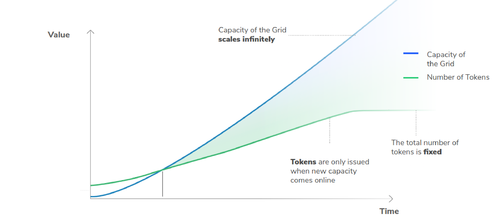

# TF Token (TFT) Valuation

The value of the TFT is based on the economic value of the TF Grid which consists of capacity for storage, compute and network. This capacity is meeting one of the fastest-growing markets globally. The combined valuation of all TFT in circulation can be expressed by the demand for capacity on the TF Grid, leading to a sound and transparent method of evaluation. 

Unlike most other cryptocurrencies that derive their market price based on speculative value, TFT represents a unit of capacity on the TF Grid. 

### The global cloud market is growing fast

Various reports from reputable resources show that the global cloud market is almost doubling its revenues between 2018 and 2023. Currently (2020) it is valued at USD 249.8Bn.
- [Gartner](https://www.gartner.com/en/newsroom/press-releases/2019-04-02-gartner-forecasts-worldwide-public-cloud-revenue-to-g
)
- [Markets and Markets](https://www.marketsandmarkets.com/Market-Reports/cloud-computing-market-234.html)
- [IDC](https://www.idc.com/getdoc.jsp?containerId=prUS45340719
)

The current growth rates only reflect the increasing demand through IoT, AI, autonomous driving and VR in developed countries that already have access to the Internet.

### TF aims to connect the unconnected

Despite the fast-growing global cloud market, the distribution of data centers is still mostly concentrated on the western world (mainly Northern America) and certain parts of Asia. 

This [source](https://wikileaks.org/amazon-atlas/map/) lists the data centers of the current market leader in cloud capacity. Other major market players follow the same patterns:
- [Oracle](https://blogs.oracle.com/cloud-infrastructure/oracle-launches-four-new-cloud-regions-across-four-continents)
- [cloudwirx](https://www.cloudwirx.com/datacenters)
- [Microsoft](https://yellowduckguy.wordpress.com/2018/03/15/microsoft-worldwide-data-center-locations/)

This inequality in the distribution of capacity can be explained by the high requirements in infrastructure, electricity and security to operate large scale data centers that often require an investment of USD 1bn+ for setup.

With the [TF Grid](grid.md) and [TF Ecosystem](partners.md), TF can also tap into the areas of our world where big cloud provider can't thanks to it's decentralized nature.

### The potential of the TF Grid
The TF Grid is a peer-to-peer Internet grid, that provides more efficient solutions than centralized alternatives. 

Considering the current global market growth, let's say the TF Grid achieves a 10% share of the current public cloud market. This would equal 500 billion USD by 2025 and translate to a 50 billion USD demand to utilize the capacity of the TF Grid through TFT as the medium of exchange for capacity. Our simulations shows that this capacity requires about 75 million [3nodes](grid\types_of_capacity.md) to be deployed on the TF Grid globally. 

For a conservative approach, our following calculations are based on achieving only a 1% market share. This still leads to an expected demand of 5 billion USD worth of capacity and thus about 7,5 million [3nodes](grid\types_of_capacity.md).

## The evaluation of all TFTs

The TF Grid can be expanded indefinitely and independent farmers are incentivized to contribute to this expansion according market demand.
The amount of TFT in circulation in the market is however limited to a maximum of [4 billion TFT](token\token_limitedsupply.md).

Considering that global demand of 50 billion USD would meet a limited supply of TFT that can never exceed 4 billion. This would mean that each TFT would have an underlying value of 12,5 USD in capacity. 
Disclaimer: Please note that we can´t and won´t make price predictions on TFT evaluation and that all calculations made here are purely hypothetical.

In the case that ThreeFold would only achieve a 1% market share, this still would lead to an expected demand of 5 billion USD worth of capacity, about 7,5 million [3nodes] and 1,25 USD in underlying value of copacity for each TFT. 

### Sustainable growth vs Hype
Market dynamics can lead to a higher valuation. Some TFT holders might not want to trade their tokens away because they expect a further increase in value. This results in a lower liquid amount of TFT meeting 5 billion USD in demand to keep the same example as above. Expectations are proven when the price increases and the valuation can enter a hype cycle that feeds into itself, leading to an economic bubble. While this can lead to big speculative gains for some, these are always the losses of others. TF does not support speculative bubbles and the worsening in global inequalities that can occur as a consequence. Therefore we wont participate in marketing activites that artificially inflate the price of TFT. We believe in a fair evaluation of TFT from the economic demand for the capacity of the TF Grid instead.

### Full transparency
Feel free to explore the simulation tool and hundreds of simulated scenarios that we built around TFT and Grid prospects [here](https://sdk3.threefold.io/#/simulator_install). 

If you have questions regarding the valuation of TFT, we are happy to provide answers in our [forum](https://forum.threefold.io/c/threefold-token/22).

***Important note: TFT’s are not an investment instrument.***
