# ThreeFold Technology Whitepaper: 
# Autonomous Layer

Author: Kristof de Spiegeleer
Version: 1.0

# Introduction

TF Tech is a software company that has developed technology capable to run any IT workload 100% autonomously. 

For the last couple of years, blockchain was synonymous with decentralization. We believe this is not true – most blockchains are not decentralized at all. They are distributed systems, but not decentralized.

Real de**central**ization is still centralized but in a different way. In our way of decentralization, we believe that you and your organizations need to become the center of your digital life.

We believe every human or legal entity should have a digital avatar, our digital self. This avatar is an application running in a well-protected environment, is online all the time, and can speak to any other digital avatar in all freedom, and with all efficiency. Much like how cells work in our body, all together we create a functioning digital world, by collaboration.

## Decentralized = Different centralized

Decentralized has the word centralized inside, but in a different way. The idea is not to make an organization or group of people the owner of a centralized system but rather the other way around – you or any legal identity becomes the center of your own digital life.

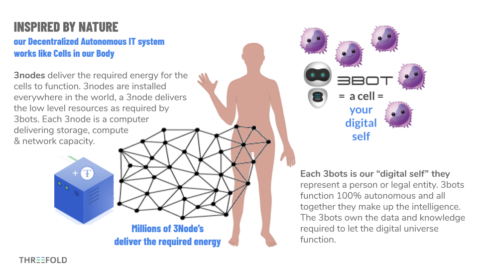

Each human person or other legal entity (can be a trust, a company, or a government department) owns one 3Bot. This is the main 3Bot you interact with, and this 3Bot can own other 3Bots.

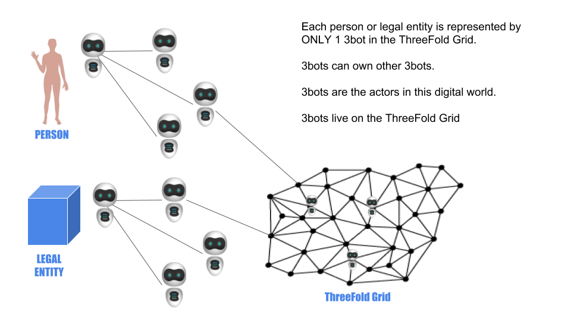

3Bots are the actors inside such a system. All data is owned **only** by 3Bots who are **owned** by the aforementioned human or legal entities. All 3Bots need to be registered in a digital phone book (implemented by means of blockchain technology).

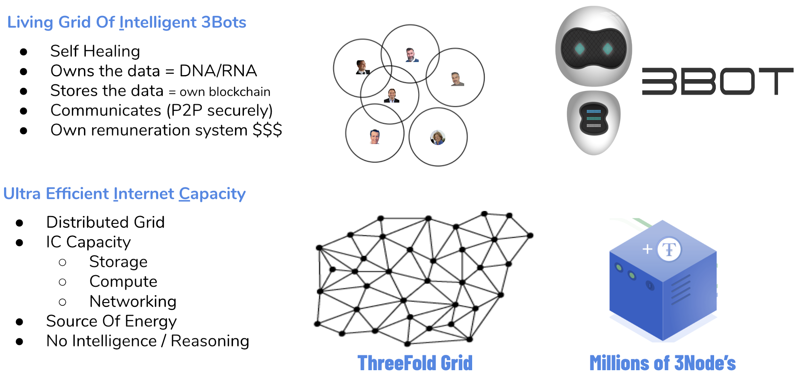

Each entity (human or legal) can define multiple circles. These circles define how we interact with other 3Bots (access rights, searchability, etc). 

# The circular smart IT system = “3Bot” powered

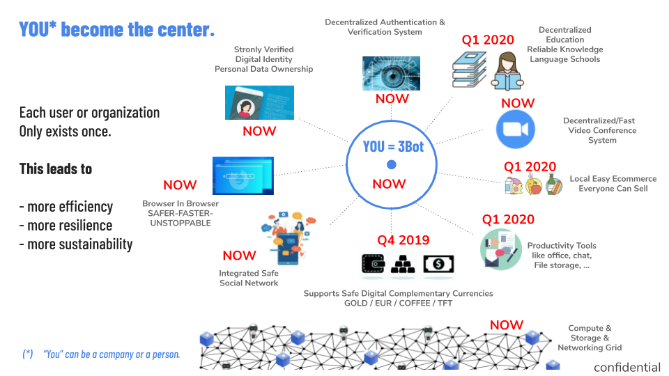

Our IT system is usable for companies, governments, citizens, schools, and so on. The system has the right balance between resilience and efficiency. A lot of services are already available today. 

## Circles define your interest groups

Circles are the groups you define, with whom you share your information.

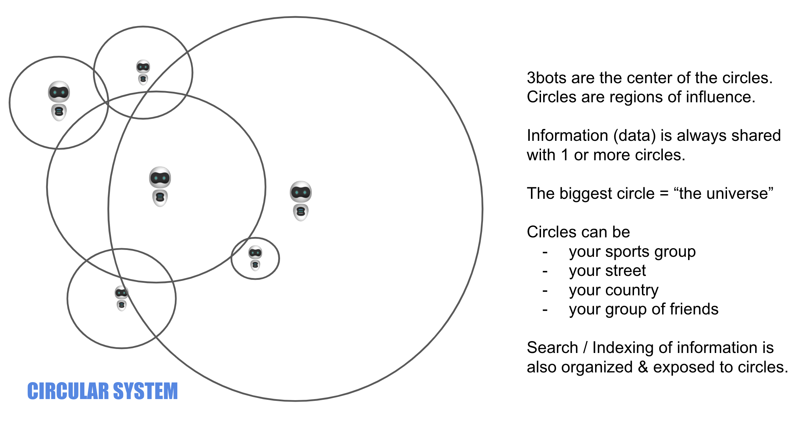

There is 0% centralization in this system. Blockchains are used where a shared state is required.

# 3Bot = Digital Avatar = Digital Self 

Your Digital Avatar (the 3Bot) has been designed to be as efficient as possible. The current memory footprint is less than 200MB yet still it is a wiki system, database, blockchain, web server, indexing & search machine, e-commerce system, wallet, decentralized exchange, and more. It can manage millions of objects and is the center of your company or your digital life.

To create this 3Bot we had no choice other than to start from scratch and re-invent a lot because existing IT components are too centralized and often too inefficient (e.g. memory hungry).

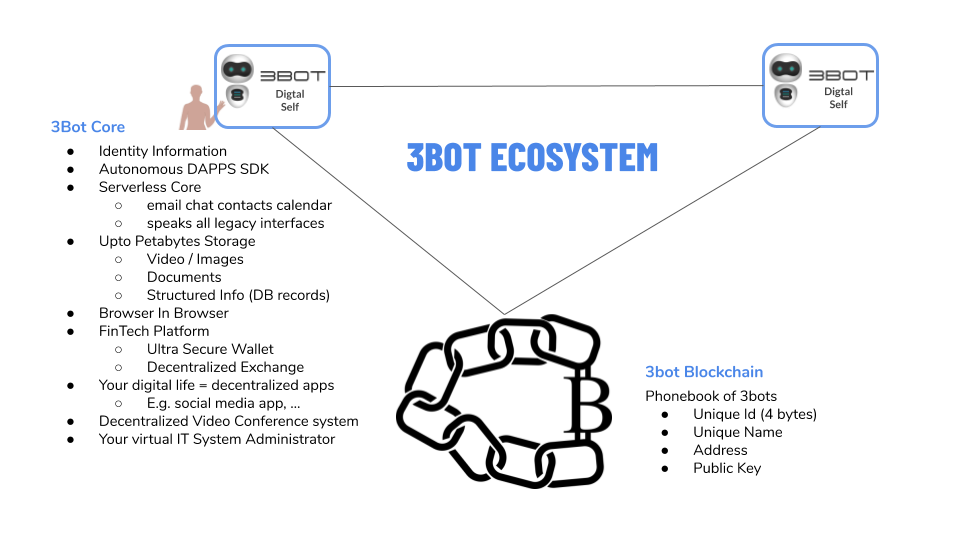

# Ultra Efficient Decentralized Data Storage System 
How is data stored  

In most distributed systems, data is stored multiple times to guarantee redundancy. This leads to a lot of unnecessary overhead and is also not the most secure mechanism.

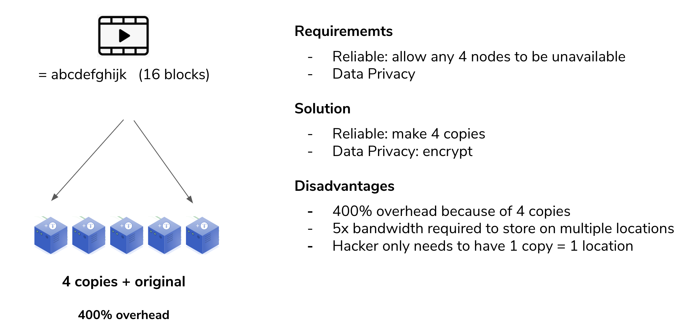

### The “Space Algorithm” of storage

The ThreeFold system uses dispersed storage algorithms and is very different in nature.

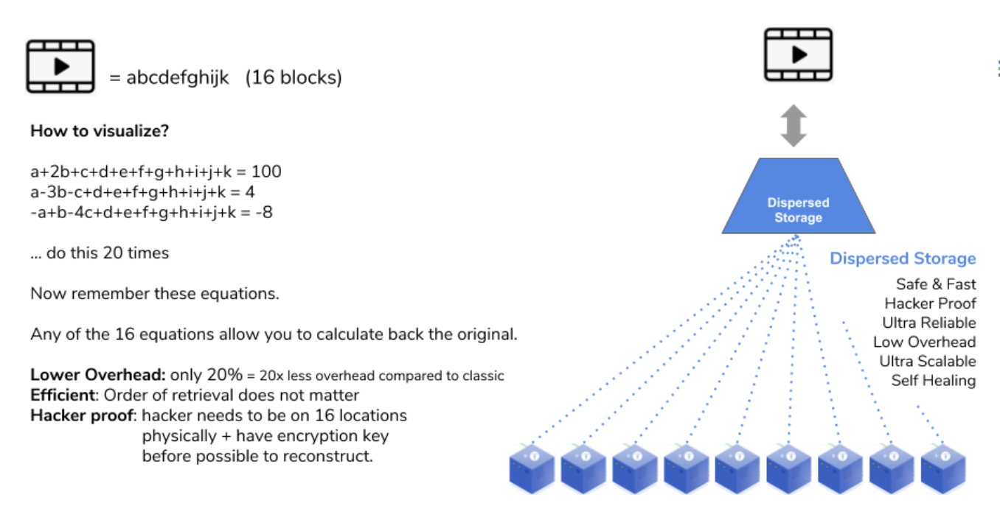

In a dispersed storage system the data gets dispersed in such a way that data will always be available even if 4 sites of the 20 (in this case) would not be available. Redundancy is the same as in the above example but the overhead is 20x less. It also has clear benefits from a security and efficiency perspective.

This has been originally invented for communication in space.

### How is this “Space Algorithm” used by the 3Bot 

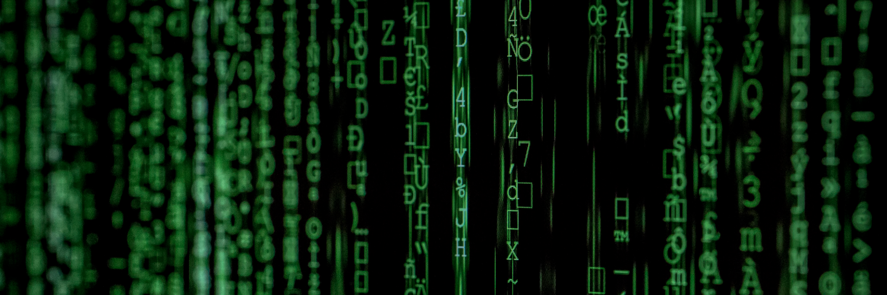

By nature, a 3Bot is stateless (has no data storage of its own). A 3Bot owns digital currency (ThreeFold Token or TFT) which the 3Bot can use to reserve raw storage and compute resources on the grid.

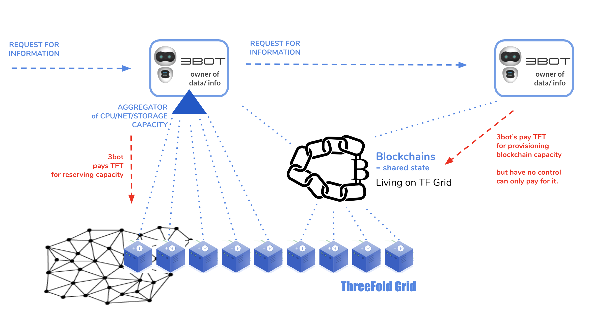

Each 3Bot has a unique capability to use this CPU and storage capacity from the different TF Nodes in the TF Grid in a safe and reliable way. Data cannot be lost because of the above described dispersed storage algorithm.

A 3Bot can store a petabyte of information as long as enough TFTs are available so the required resource can be reserved on the individual TF Nodes. 3Bot is the only entity which has the required information and keys to make retrieval of the distributed data possible.

## BCDB

Our powerful Blockchain database.

The blockchain database has the following features:

*   Schemas (strongly typed)
*   3 types of indexing: key-based, full text search, and a full SQL compliant indexer
*   Multiple interfaces: REST, Redis, JavaScript client,, Python auto-generated client
*   Large and small objects can be stored (MBs to bytes)
*   All expected features from a blockchain are part of this product (e.g. immutability, verification, consensus, etc)
*   Encryption of data
*   We can guarantee full privacy for e.g. GDPR regulations (data is always 100% private, not shared)
*   ACLs = Access Control Lists
*   Multisignature
    *   For validation of new data
    *   For an update of data
    *   For invalidation (like delete, but data never really goes away – just becomes invalid)

Supported interfaces: WebDav, Redis, REST \

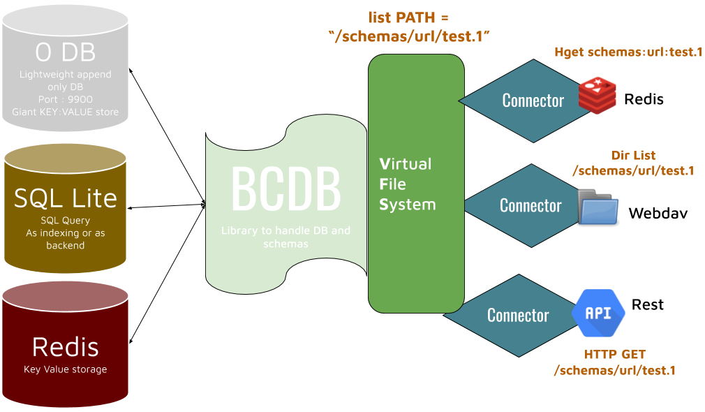

Depending on the type of required indexing, different support backend data storage or indexing systems are used. The main supported backend storage device is Zero-DB. 

## BCDB is the most efficient information retrieval system possible

In the current Internet, retrieving information happens in two ways:

**Centralized**

*   Based on a URL (a unique resource locator), which is typically rather long
*   A URL can only be used in a centralized context. It has been designed for that purpose. 
    *   _Example URL: https://images.unsplash.com/photo-1555434992-f1670f5e8fce?ixlib=rb-1.2.1&ixid=eyJhcHBfaWQiOjEyMDd9&auto=format&fit=crop&w=934&q=80_
*   Today +99% of all information is stored this way
*   You have to rely on the provider of the information (normally not the author) to deliver good uptime and enough connectivity to the Internet

**Distributed**

Blockchain or other distributed database

*   A long key e.g. 32 characters, or even 64
*   The data is distributed (sometimes replicated) over big areas – the data is not linked to the author but spread over a large area controlled by a blockchain or by a centralized application
*   The lookup process is typically slow – a special algorithm allows you to find the information in multiple steps, and there is no guarantee that the data is close to you when you need it.

In the suggested circular decentralized system there is only need for two numbers, to retrieve any information in the world. One number is to find which digital avatar to talk to, the other number is to find the information in the digital avatar of the data owner (can be human person or other legal entity).

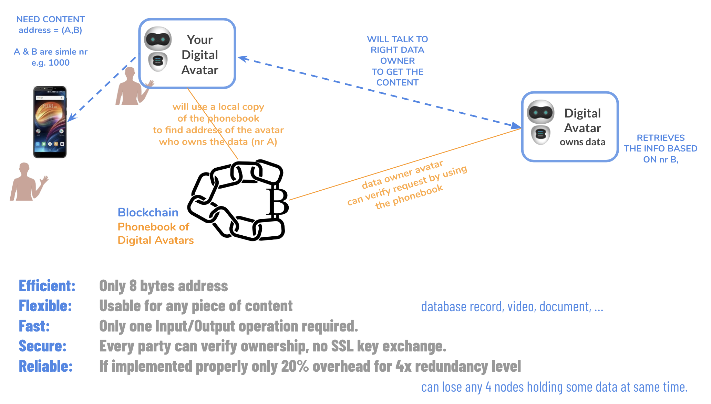

Information can be a movie, for example, or a single piece of information like your email address. Each digital avatar is responsible for retrieving & reconstructing the information from the underlying IT capacity network (the nodes on a decentralized internet). This happens in a very secure way and the digital avatar is the only digital entity capable of re-assembling the information in such a way it makes sense again. This leads to very strong security.

**With only two numbers any information in the world can be addressed.**

This way of how to address information has far-reaching implications and can change the way how the Internet works.

## Indexing & Search Problem

A difficult problem in a fully decentralized system is how to index and search for information.

When an author (in a company or private context) creates content, he or she needs to define access rights to one or more circles. If giving read access to the universe circle, it basically means everyone can retrieve the information. Each piece of information also needs labels – these are labels you freely choose and do not necessarily have a meaning outside of your own environment.

There are some automatic labels like type of document, creation date, or location of creation (e.g. photo).

An author can define which part of the document (if not all) is available for indexation.

In the TF Grid there are aggregation providers which are deployed (paid for) and owned by a specific 3Bot. These aggregation providers list themselves into the aggregator blockchain (BCDB).

Aggregator Examples:

*   Big data analysis tool
*   Company employee directory
*   AI tools

End user examples

*   A football club directory
*   A city merchants organization

Each aggregator is basically a 3Bot who gets rights to query indexing and/or the information behind.

Each 3Bot (as instructed by their owners) needs to inform the required aggregators to index/access the information (in a broad sense: video, address details, documents, news as stored in the 3Bot. The 3Bot can use a combination of labels and circles to do so.

Example:

*   You create blog articles about food and want to be listed on an aggregator site of healthy food.
*   You found this aggregation site because of consulting the aggregator blockchain (of course there are nice tools available to make this user-friendly).
*   You can now instruct your 3Bot to list all your relevant blog articles with labels “food” & “healthy” to that aggregator.
*   The aggregator will now receive instructions to index the information and list it in its own application to the intended audience.
*   The aggregator has the right to accept the information or not.
*   The aggregator can make a commercial business out of it and can decide to give part of the income to the original authors of the information using, for example, TFTs. 

    Important to note, the information itself does not get stored on the aggregator site, only when creating the index. The required index information is being provided and used to create the index. This means that sensitive information will stay on the author 3Bot, and only fields relevant for indexing will go to the aggregator.

This system is super scalable because aggregator sites by themselves are limited in scope and do pre-sorting of information people look for (e.g. an Uber alternative only makes sense in a certain region – there is no point to have a global Uber aggregation site). It's even possible to create aggregators of aggregator sites ie. Sites which make it easy to query information over multiple aggregators.

# This leads to endless scalability 
The above-suggested architecture scales endlessly. Millions of 3Bots = digital avatars can work with millions of nodes. The nodes provide the capacity, the digital avatars are the brain. There is no bottleneck in this architecture.

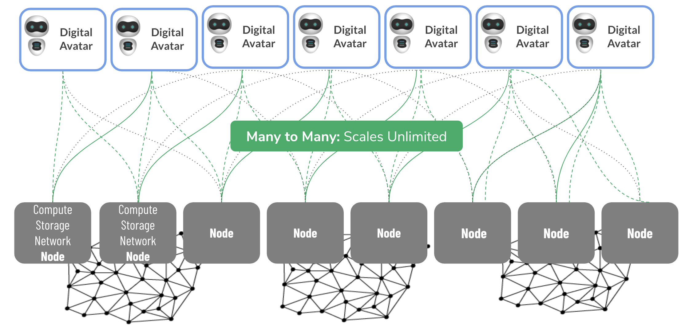

# Example Use Cases

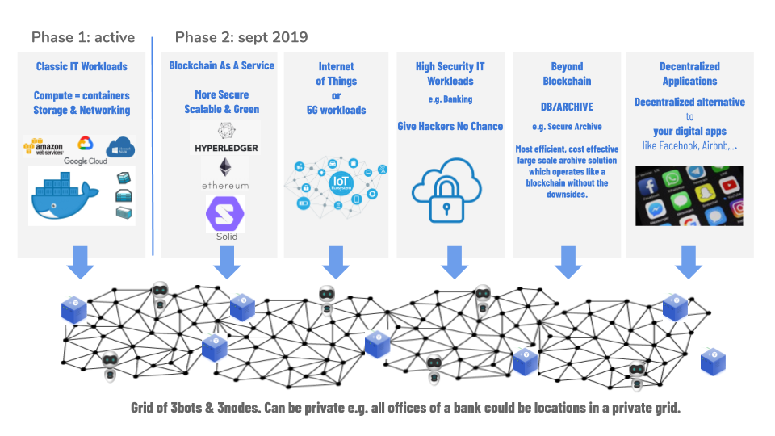

## Blockchain as a service Workloads

ThreeFold has resolved the blockchain dilemma problem (see [the Blockchain Dilemma Whitepaper](blockchain_dilemma_whitepaper.md).)

We believe in a world of many focussed custom blockchains which all serve a specific purpose. The blockchain as a service will allow any group of people to deploy their own customer blockchain which can be used for digital currencies, digital notary. or other blockchain purposes.

Today the TFT (ThreeFold Token) is running as a blockchain on top of our TF Grid.

Our platform is ideal to host other blockchain technologies as well. Our platform is like a blockchain to service other blockchains. We have the capability to resolve the blockchain dilemma problem (resulting in a technology that has the best of both worlds – the security of a public blockchain with the performance of a private one) for other blockchain algorithms, not created by us. In other words, we can deliver scale & privacy for 3rd party blockchains.

Our blockchain as a service platform allows anyone to launch a blockchain in minutes while maintaining:

*   Privacy (optional)
*   Scale
*   No people needed to manage

## Hacker-Free Deployment of Apps

Hackers (security breaches) are a very big issue for most operational companies today.

Building fences around sensitive information will never be safe enough (with current methodology) because there are always people having access that might be compromised (knowingly or unknowingly) and people can make mistakes.

What if a system would exist which allows to deploy a workload without involvement of any person? No one, not the IT administrator, or the person who paid for the IT service, or _any_ other person, has the ability to influence the operations of the IT workload.

This sounds probably too good to be true, but in Q4 2019 we will be able to demonstrate this to anyone. This has never been done before.

# ThreeFold Blockchain Technology 

## Thanks to the TFGrid the Blockchain Dilemma has been resolved 

Blockchain comes in two varieties: based on public nodes (everyone can partake) and private nodes (a known, limited amount of nodes partaking). They both have their advantages as shown in the diagram below:

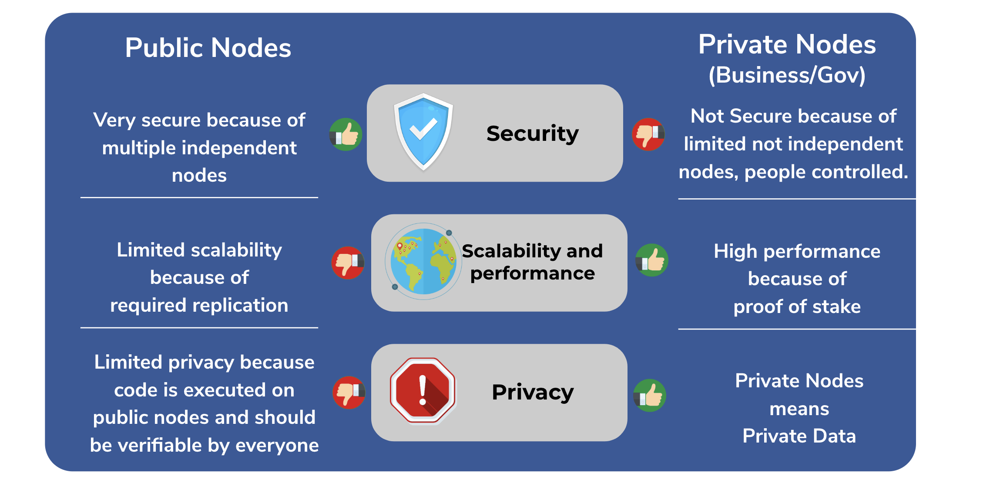

The specifics of both implementations lead to the so-called blockchain dilemma – both represent good features and have specific advantages but they have not been able to be combined into one. 

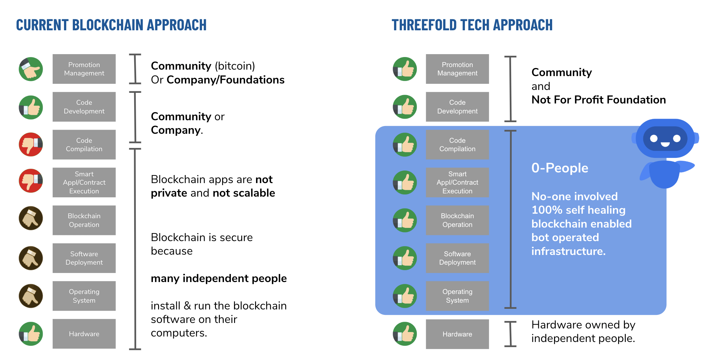

A permissioned blockchain setup requires people. In our setup, that is not the case. And because of this, the blockchain dilemma problem does not apply any longer.

Our technology is the missing layer for blockchain and can be used to make any blockchain technology more scalable, sustainable, efficient and secure.

# ThreeFold Blockchains

In our solution, we use our blockchain technology to run multiple blockchain instances. For digital currencies it will be Rivine and for storing and getting consensus around data it is the BCDB.

## The BlockChain DataBase (BCDB): a blockchain for storing data (dispersed) 

### 3Bot data: The 3Bot Directory 

3Bots are the active components of the autonomous layers. 3Bots represent individuals and other legal entities, and in order to operate they need to interact amongst different ones. The 3Bot blockchain provides the means for 3Bot to identify who they need to complete their operational task. The 3Bot blockchain acts as their phone book. Each 3Bot has an entry in this phonebook. The following information is stored specific to each 3Bot:

*   Unique global ID (is a nr)
*   Name (a name e.g. kristof.ibiza)
*   Address, which allows other 3Bots to find your 3Bot
*   Public Key, which is important to establish secure communication between 3Bots
*   Generic Usable Data Field

With this data stored in a way that is accessible to all each 3Bot has the means to find which other 3Bot he needs and where to contact this 3Bot to complete certain operational tasks

### Grid data: TF Grid Directory

In this blockchain database, the builders of the grid (farmers) and their equipment (nodes) are stored and searchable for anyone to create a marketplace that makes the supply searchable for people who need (demand) compute, storage, and network capacity.

The information stored in this blockchain database for farmer and nodes is:

*   Unique global ID (is a nr)
*   A chosen name (can be a GUID or a name per node – is a free field, is like a DNS name)
*   Address = the 3Bot name who represents this node
*   Data field which has info about the node
    *   Farmer ID
    *   Capacity  (resource units: Compute Unit, Storage Unit, Network Unit)

### Contract data: TF Notary Service

The TF Grid is a busy place with people setting commercial rates and terms and conditions for their farming capacity, consumers searching and contracting services, data is being dispersed and stored, and IT architectures recipes are being created and used. For all these activities, the notary service provides an immutable, always append contract and activity notary system in which all digital records are stored. Eventually, there will be more than one TF Notary blockchain to allow scalability of the system.

The following information is stored:

*   Unique global ID (is a nr)
*   A chosen name (can be a GUID or a name per node – is free field, is like a DNS name. The blockchain makes sure this chosen name is unique)
*   Address  = the 3Bot who owns this registered information (optional)
*   Data field which has the info to be registered (can be any format but max 2000 characters in size)

This is a generic usable data store for any application, it is a possible backend for the application layer.

## Blockchains for storing value 

### TFT or any other digital currency Blockchain 

Threefold has created its own blockchain technology called Rivine which is used sell and buy capacity on the ThreeFold Grid. 

### Digital Currency Blockchain As A Service 

Complementary Digital currencies are here to stay. Complementary currencies are not new and have always been around to compensate for when main (fiat) currencies fail. In the last decade, digital complementary currencies have gained interest and respect of many people globally. They represent opportunities for people that have no access to traditional banking services. They provide alternative means of value transfer between individuals and legal entities, making it more effective, with lower cost, and independent of traditional value exchange mechanisms.

Like traditional mileage systems of airlines (which is an example of a complementary digital currency) many more of these will come into existence over the next couple of years. The local football club might come up with their own value exchange mechanism for running their own internal economy in such a way that is specific to the football club, branded to the football club, and has supporters exchanging value amongst each other, with the fan shop, in the cafeteria, and canteens.

With the TF Grid as a platform to run on, anyone can start their own digital currency for a particular use case. TF Grid is compatible with any blockchain technology. It will create a system for value exchange and the necessary governance and consensus by people who co-own and operate the specific local blockchain.

# White Paper Takeaways 

1. Blockchain technology is here to stay but is not the single answer to the exponential growth requirements of digital services.
2. Centralization of data ownership and storage is not bad if the owner is the creator of the data, not the aggregator.
3. A new technology paradigm is needed to bring blockchain technologies and decentralized compute and storage together.
